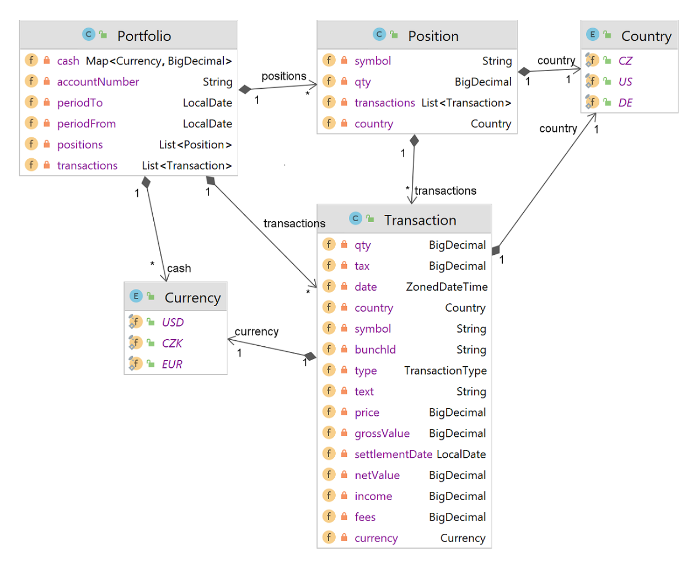
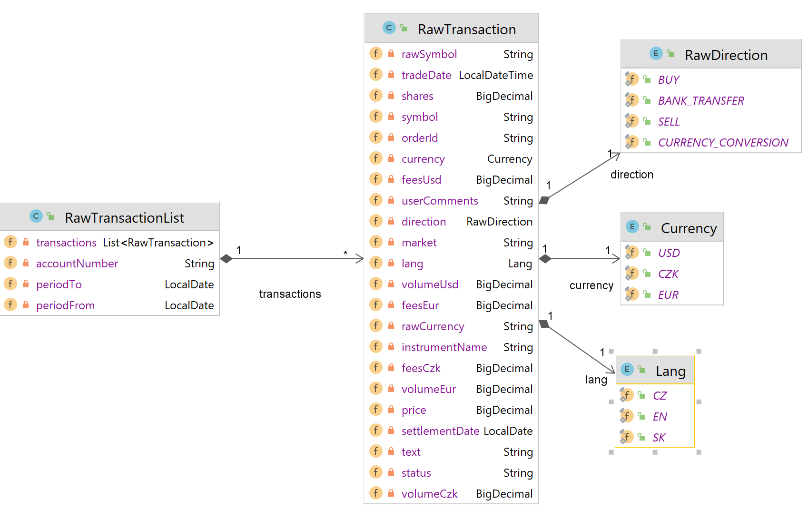

# Brinvex Fiobank Utils

## Introduction

_Brinvex FioBank Utils_ is a compact Java library which enables developers to easily work with Fiobank E&#x2011;Broker data.

## How to use it

- Add dependencies
````
<dependency>
    <groupId>com.brinvex.util</groupId>
    <artifactId>brinvex-util-fiobank-api</artifactId>
    <version>1.1.0</version>
</dependency>
<dependency>
    <groupId>com.brinvex.util</groupId>
    <artifactId>brinvex-util-fiobank-impl</artifactId>
    <version>1.1.0</version>
    <scope>runtime</scope>
</dependency>
````
- Process transactions reports
````
FiobankBrokerService svc = FiobankServiceFactory.INSTANCE.getBrokerService();

PortfolioPeriod ptf = svc.processStatements(List.of(
    "c:/tmp/Fio_Broker_Transactions_2020_CZ.csv",    
    "c:/tmp/Fio_Broker_Transactions_2021_CZ.csv",    
    "c:/tmp/Fio_Broker_Transactions_2022_CZ.csv",   
));
````
- Access returned Portfolio data structure offering consolidated detailed overview of  
  - positions
  - cash
  - transactions
  - dividends
  - fees
  - taxes
  - transformations



- If you prefer just raw Java object reflecting Fio transaction report structure use
````
PortfolioPeriod ptf = svc.parseStatements(List.of(
    "c:/tmp/Fio_Broker_Transactions_2020_CZ.csv",    
    "c:/tmp/Fio_Broker_Transactions_2021_CZ.csv",    
    "c:/tmp/Fio_Broker_Transactions_2022_CZ.csv",   
));
````


### Requirements
- Java 11 or above

### License

- The _Brinvex FioBank Utils_ is released under version 2.0 of the Apache License.
