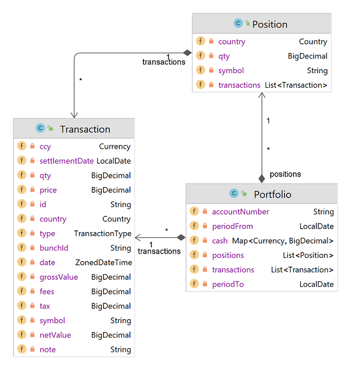

# Brinvex-Util-Fiobank

## Introduction

_Brinvex-Util-Fiobank_ is a compact Java library which enables developers 
to easily work with data coming from Fio bank account or Fio E&#x2011;Broker account.

## Maven dependency declaration
To use _Brinvex-Util-Fiobank_ in your Maven project, declare the following dependency in your project's pom file. 
No transitive dependencies are required during compilation or at runtime.
````
<dependency>
    <groupId>com.brinvex.util</groupId>
    <artifactId>brinvex-util-fiobank-api</artifactId>
    <version>2.0.3</version>
</dependency>
<dependency>
    <groupId>com.brinvex.util</groupId>
    <artifactId>brinvex-util-fiobank-impl</artifactId>
    <version>2.0.3</version>
    <scope>runtime</scope>
</dependency>
````
## Features

- #### Transform Fio Broker csv reports into cleaner and more robust data model

````
FioBrokerService svc = FioServiceFactory.INSTANCE.getBrokerService();
Portfolio ptf = svc.processStatements(List.of(
    "c:/tmp/Fio_Broker_Transactions_2021_CZ.csv",    
    "c:/tmp/Fio_Broker_Transactions_2022_CZ.csv"   
));
````


- #### Parse Fio Broker csv reports into Java object reflecting Fio Broker transaction structure
````
FioBrokerService svc = FioServiceFactory.INSTANCE.getBrokerService();
Portfolio ptf = svc.parseStatements(List.of(
    "c:/tmp/Fio_Broker_Transactions_2021_CZ.csv",    
    "c:/tmp/Fio_Broker_Transactions_2022_CZ.csv"   
));
````


- #### Transform Fio Bank Current Account xml reports into cleaner and more robust data model
````
FioBankService svc = FioServiceFactory.INSTANCE.getBankService();
Portfolio ptf = svc.processStatements(List.of(
    "c:/tmp/Fio_Bank_Transactions_2021.xml",  
    "c:/tmp/Fio_Bank_Transactions_2022.xml"  
));
````

- #### Fetch Fio Bank Current Account xml report via Fio API
````
FioBankService svc = FioServiceFactory.INSTANCE.getBankService();
String xml = svc.fetchStatement(
    API_KEY, 
    LodalDate.parse("2022-01-01"),
    LodalDate.parse("2022-12-31")  
));
````


### Requirements
- Java 11 or above

### License

- The _Brinvex-Util-Fiobank_ is released under version 2.0 of the Apache License.
